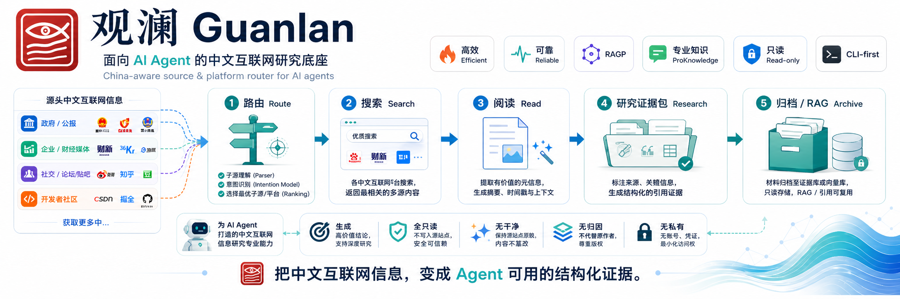

<h1 align="center">观澜 / Guanlan</h1>

<p align="center">
  <strong>让 AI Agent 看懂中文互联网</strong>
</p>

<p align="center">
  临流观势，循源取义。观澜是面向 AI Agent 的中文互联网研究工具：会路由信源、阅读网页、观察热榜、整理证据。
</p>

<p align="center">
  
  
  
  
  
</p>

<p align="center">
  <a href="#30-秒-tldr">30 秒 TL;DR</a> ·
  <a href="#安装">安装</a> ·
  <a href="#安全边界">安全边界</a> ·
  <a href="#文档入口">文档</a>
</p>

<p align="center">
  语言：<strong>中文</strong> ·
  <a href="docs/README_en.md">English</a> ·
  <a href="docs/README_ja.md">日本語</a> ·
  <a href="docs/README_ko.md">한국어</a>
</p>

<p align="center">
  
</p>

## 30 秒 TL;DR

普通搜索让 Agent 看见网页，观澜让 Agent 看懂中文互联网。

观澜不是“又一个搜索 CLI”，而是给 AI Agent 用的中文互联网研究底座：它会先判断该去哪里找，再把网页、热榜、RSS、官方源、垂类媒体和社区样本整理成可追溯的证据上下文。

如果你只想先用起来：

```bash
uv tool install --force --upgrade --refresh --default-index https://pypi.org/simple guanlan
guanlan version
guanlan agent "人工智能 政策 最新" --json
guanlan search "人工智能 政策 最新" --profile china --limit 80
```

## 最稳能力

1. **中文网页搜索**：公开网页搜索、去重、排序、来源标注，默认给 Agent 足够大的候选池。
2. **信源路由**：政策看官方和党央媒，口碑看社区样本，技术看开发者与 RSS，产业看垂类媒体。
3. **网页阅读**：把网页转成 Markdown；公众号文章优先走公开专项抽取，并提供正文质量、噪声、fallback 和 trace。
4. **热榜观察**：用 `hotnews` 和 `feeds` 帮 Agent 观察“今天中文互联网在涌动什么”。
5. **股票财经结构化入口**：`guanlan stock` / `guanlan_stock` 先拿股票行情、指数、ETF/基金净值、资金流、榜单和时效边界，再回到公告、宏观、研报和情绪样本分层核验。
6. **证据包输出**：`research`、`compare`、`timeline`、`dossier`、`recipe`、`archive`、`--format context` 面向 Agent 继续推理。
7. **长期意图雷达**：`watch` 把一次性 query 固化为本地 standing intent，按需 fire，复用搜索、RSS、归档和去重状态发现新线索。

## 典型命令

```bash
# 1. 搜中文网页，默认建议给 Agent 足够候选池
guanlan agent "WPS AI 灵犀 最近热点" --mode fresh --json
guanlan search "新质生产力 政策 原文" --profile china --limit 80 --trace

# scope 默认是软收敛：优先看这类信源，质量不足时自动混入开放网页
guanlan search "AI Agent 发展趋势 2025" --profile china --scope tech_dev --limit 80 --trace

# 为 WPS/AI Office 赛道找选题线索，品牌、竞品、技术、信创、安全和热点一起看
guanlan research "WPS AI PPT Agent 办公选题 最近热点" --preset wps_office --limit 80 --read-top 5 --advisor

# 股票/指数/ETF/基金净值/资金流先走结构化入口，不要让 Agent 硬读动态财经页
guanlan stock plan "宁德时代 股价 财报 公告 最近风险"
guanlan stock quote "024051"
guanlan stock detail "宁德时代"

# 2. 读取网页正文，检查是否干净
guanlan read "https://example.com/article" --quality-report --trace
guanlan read "https://mp.weixin.qq.com/s/ARTICLE_ID" --trace --max-chars 12000

# 用户自配公众号导出服务后，才使用授权 exporter 适配器
guanlan wechat-exporter status --probe
guanlan wechat-exporter account-search "公众号名称" --json

# 3. 做一份 Agent 可直接使用的研究证据包
guanlan research "某产品 用户评价 值不值得买" --preset reputation --advisor --format context
guanlan recipe run public-opinion-pulse "某产品 最近风评 被夸还是被骂"
guanlan recipe run competitor-watch "某产品 竞品 功能 定价 口碑"

# 4. 看今日中文互联网水势
guanlan hotnews today --limit 80 --trends

# 5. 把一个主题变成长期观察意图，先诊断 fire，再按需记录 seen
guanlan watch plan "OpenAI API release notes" --profile english
guanlan watch add "WPS AI PPT Agent 办公选题" --feed-source curated --schedule "daily 09:00"
guanlan watch fire <id> --record-seen --limit 30

# 6. 不确定去哪搜时，先看信源路由
guanlan route "AI 产业政策 地方 补贴" --json

# 7. 想系统搞懂一个对象时，先生成对象脉络/同类格局研究链路
guanlan recipe run trajectory-map "Cursor 发展历程 竞品格局"
```

更多命令见 [完整使用手册](docs/full-guide.md) 和 [Agent 使用指南](docs/agent-usage.md)。

## 安装

推荐任选一种方式。安装或升级后，先确认版本和路径，避免 Agent 调到旧版。

### Homebrew

```bash
brew update
brew tap shenyangs/tap
brew reinstall shenyangs/tap/guanlan
```

### uv

```bash
uv tool install --force --upgrade --refresh --default-index https://pypi.org/simple guanlan
```

### pipx

```bash
pipx install --force guanlan
```

### 验证

```bash
guanlan version
guanlan doctor --install-check
guanlan status
```

看到 `观澜 / Guanlan v0.6.4`，并且安装检查没有版本/路径漂移，就说明基础部署成功。

## 给 Agent 复制的安装指令

```text
请帮我安装观澜 CLI，并验证基础功能可用。

优先使用：
uv tool install --force --upgrade --refresh --default-index https://pypi.org/simple guanlan

安装完成后运行：
guanlan version
guanlan doctor --install-check
guanlan status

如果 guanlan version 不是 README 标注的当前版本，请不要继续配置 MCP 或可选渠道，先排查 PATH 和安装来源。

安全要求：不要读取浏览器 Cookie，不要触发登录授权，不要请求钥匙串权限。
```

## 安全边界

观澜默认只读、低扰、明源。

- 默认不读取浏览器 Cookie、钥匙串、登录态或私密配置。
- 浏览器辅助补证只读取用户授权后的目标页可见内容；Cookie 读取必须另行说明平台、用途、风险和只读范围，并获得单独明确授权。动态页补证使用会话契约、内容就绪信号和采集充分性，不把固定等待或空结果当作成功。
- 不自动点赞、评论、关注、发帖或发送消息。
- 高风险平台能力保持 `best-effort` / `opt-in` / `experimental` 口径，不包装成稳定端到端能力。
- `doctor` 默认不做深度授权探测；需要认证检查必须显式运行相关命令。
- Archive、Wiki、LLM Wiki、RAG 导出都基于本地已归档资料，不代表全网事实。
- 真实网络超时应被视为网络/上游证据，不应直接解释为“没有结果”。

## 文档入口

| 你想做什么 | 去哪里看 |
| --- | --- |
| 完整命令和长说明 | [完整使用手册](docs/full-guide.md) |
| Agent 怎么正确调用观澜 | [Agent 使用指南](docs/agent-usage.md) |
| 安装、升级和路径排查 | [安装指南](docs/install.md) / [更新指南](docs/update.md) / [故障排查](docs/troubleshooting.md) |
| 本地模型联网 | [Local LLM 指南](docs/local-llm.md) |
| 精选信源包 | [Source Packs](docs/source-packs.md) |
| 热点目录接入 | [热点目录接入](docs/hotboard-api.md) |
| 输出字段稳定契约 | [Contract](docs/contract.md) |
| 中文互联网设计依据 | [China-Aware Web Rationale](docs/chinese-web-design.md) |
| 发版和质量闸门 | [Release Automation](docs/release-automation.md) / [Quality Test Plan](docs/quality-test-plan.md) |
| 路线图 | [Roadmap](docs/roadmap.md) |

## 项目定位

观澜当前仍是 Alpha 阶段的 CLI-first 工具。最稳路径是公开搜索、网页阅读、热榜观察、研究证据包和本地归档；部分平台能力依赖公开页面、外部后端、网络环境或显式授权。

> 临流观势，循源取义。观澜让 Agent 在进入中文互联网之前，先学会“观”。

## License

MIT License. See [LICENSE](LICENSE) for details.
